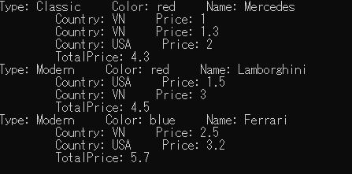
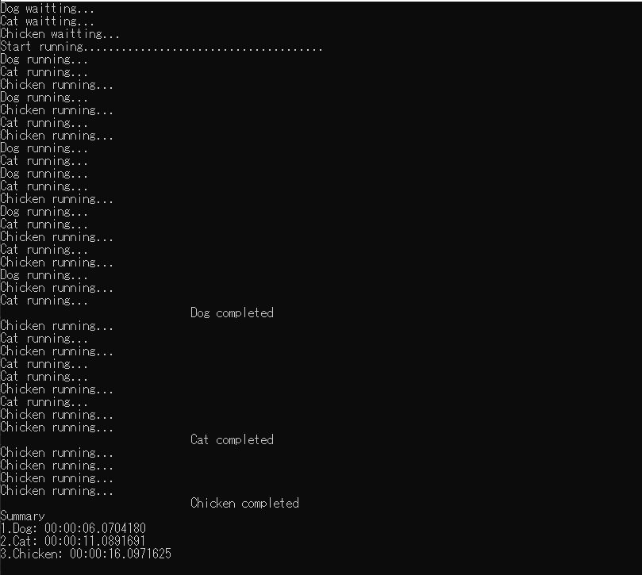

Git workflow atlassian: https://www.atlassian.com/git/tutorials/comparing-workflows/gitflow-workflow
```bash
$ git checkout develop
$ git checkout -b feature-{your_name}
$ git add .
$ git commit -m "your message"
$ git push origin feature-{your_name}

create merge request in gitlab
```
# Exercises 1
1. Write the function as follows:
```bash
        /// <summary>
        /// Convert the value of the parameter passed
        /// Does not depend on the data type of the parameter passed
        /// The transmitted data type limit is Struct
        /// </summary>
```
```bash
        /// <param name="value"></param>
        /// <param name="idefault"></param>
```
```bash
        /// <returns>
        /// The value of the parameter passed according to its data type
        /// If the parameter passed has no value, the default is idefault
        /// </returns>
```
2. Write the program as follows:
```bash
    public class Category
    {
        public string Type { get; set; }
        public string Name { get; set; }
        public string Color { get; set; }
        public int Count { get; set; }
        public decimal TotalPrice { get; set; }
        public List<Product> Products { get; set; }
    }
    
    public class Product
    {
        public string Type { get; set; }
        public string Name { get; set; }
        public string Color { get; set; }
        public string Country { get; set; }
        public string Price { get; set; }
    }
    
    var list = new List<Product>()
    {
        new Product()
            {Type = "Classic", Color = "red", Country = "USA", Name = "BMW", Price = "1"},
        new Product()
            {Type = "Modern", Color = "red", Country = "USA", Name = "Lamborghini", Price = "1.5"},
        new Product()
            {Type = "Classic", Color = "red", Country = "VN", Name = "Mercedes", Price = "1"},
        new Product()
            {Type = "Classic", Color = "blue", Country = "USA", Name = "Mercedes", Price = "1.2"},
        new Product()
            {Type = "Classic", Color = "red", Country = "USA", Name = "Mercedes", Price = "2"},
        new Product()
            {Type = "Modern", Color = "blue", Country = "VN", Name = "Ferrari", Price = "2.5"},
        new Product()
            {Type = "Modern", Color = "blue", Country = "USA", Name = "Ferrari", Price = "3.2"},
        new Product()
            {Type = "Classic", Color = "red", Country = "VN", Name = "Mercedes", Price = "1.3"},
        new Product()
            {Type = "Modern", Color = "red", Country = "VN", Name = "Lamborghini", Price = "3"},
    };
```

- Using LINQ get information.



# Exercises 2
2. Write the program as follows:
- Using Task and Thread.



